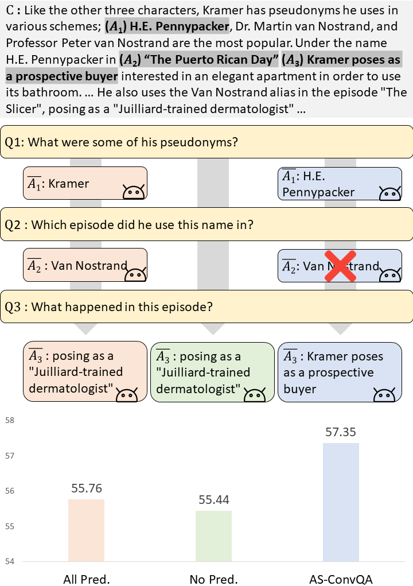

# Realistic Conversational Question Answering with Answer Selection based on Calibrated Confidence and Uncertainty Measurement

Official Code Repository for the paper "Realistic Conversational Question Answering with Answer Selection based on Calibrated Confidence and Uncertainty Measurement" (EACL 2023): https://arxiv.org/abs/2302.05137

## Abstract
<div align="center">
  
</div>


Conversational Question Answering (ConvQA) models aim at answering a question with its relevant paragraph and previous question-answer pairs that occurred during conversation multiple times. To apply such models to a real-world scenario, some existing work uses predicted answers, instead of unavailable ground-truth answers, as the conversation history for inference. However, since these models usually predict wrong answers, using all the predictions without filtering significantly hampers the model performance. To address this problem, we propose to filter out inaccurate answers in the conversation history based on their estimated confidences and uncertainties from the ConvQA model, without making any architectural changes. Moreover, to make the confidence and uncertainty values more reliable, we propose to further calibrate them, thereby smoothing the model predictions. We validate our models, Answer Selection-based realistic Conversation Question Answering, on two standard ConvQA datasets, and the results show that our models significantly outperform relevant baselines.

## Installation

We use a single GeForce RTX 3090 GPU having 24GB memory to train and evaluate AS-ConvQA models. We refer to the following two repositories:
* https://github.com/dmis-lab/excord 
* https://github.com/mlaves/bayesian-temperature-scaling

```bash
$ conda create -n asconvqa python=3.8
$ conda activate asconvqa
$ conda install tqdm
$ conda install pytorch==1.5.0 cudatoolkit=10.1 -c pytorch
$ pip install transformers==3.3.1
$ conda install tensorboardX
$ pip install matplotlib
```


## Dataset
We use QuAC dataset, which can be downloaded from here: https://quac.ai/. Please note that since the test set is not publicly open, we evaluate models with the validation set.

## Run
As described in the Section 3.5 in our paper, the overall pipeline is implemented with the following 2 steps:

1. Step 1

We start training a model with gold answers.
```bash
bash script/0_step1_train.sh
```

Then, we make inference to obtain predictions together with its confidence and uncertainty.

```bash
# AS-ConvQA_conf
bash script/conf/1_step1_inference.sh

# AS-ConvQA_uncer
bash script/uncer/1_step1_inference.sh
```

2. Step 2

We further train the model to reflect the predicted answers instead of the ground-truth answers.

```bash
# AS-ConvQA_conf
bash script/conf/2_step2_train.sh

# AS-ConvQA_uncer
bash script/uncer/2_step2_train.sh
```

We evaluate AS-ConvQA models only using the confident or certain predictions against the threshold.

```bash
# AS-ConvQA_conf
bash script/conf/3_step2_eval.sh

# AS-ConvQA_uncer
bash script/uncer/3_step2_eval.sh
```

## Citation
If you found the provided code with our paper useful, we kindly request that you cite our work.
```BibTex
@inproceedings{jeong2023realistic,
    title={Realistic Conversational Question Answering with Answer Selection based on Calibrated Confidence and Uncertainty Measurement},
    author={Jeong, Soyeong and Baek, Jinheon and Hwang, Sung Ju and Park, Jong C.},
    booktitle={European Chapter of the ACL (EACL)},
    year={2023},
}
```